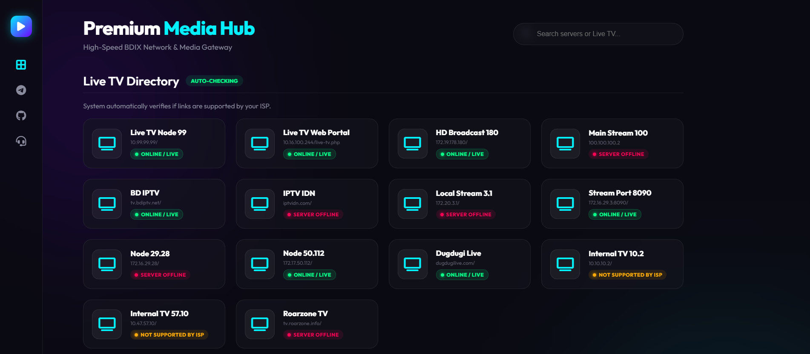
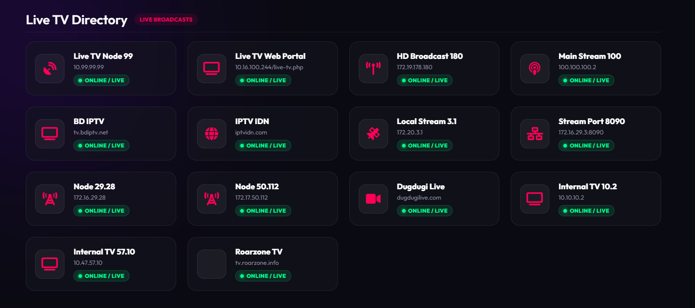
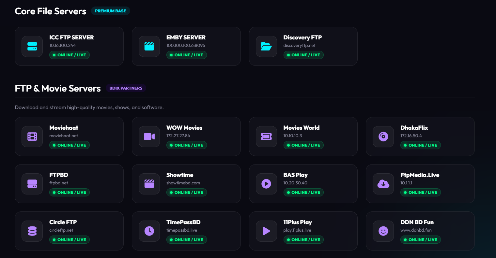
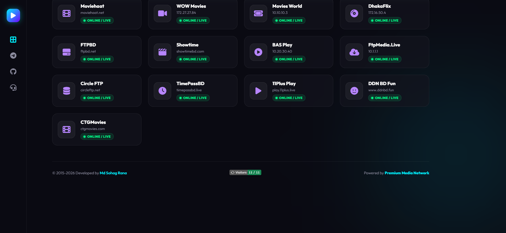
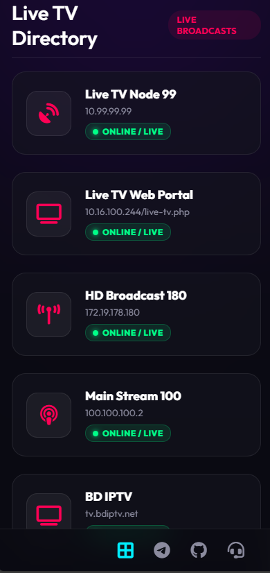

<div align="center">

# 📺 Premium Media Hub

**A Centralized Powerhouse for Digital Entertainment & Live Streaming**

[](https://github.com/sohag1192/Premium-Media-Hub)
[](https://sohag1192.github.io/Premium-Media-Hub)
[](https://opensource.org/licenses/MIT)

Premium Media Hub seamlessly bridges the gap between traditional live TV, modern VOD (Video on Demand), and premium software distribution into one elegant, high-performance web interface.

</div>

<br />

## 📋 Table of Contents
- [✨ Key Features](#-key-features)
- [💻 Tech Stack](#-tech-stack)
- [📸 Visual Gallery](#-visual-gallery)
- [📂 Project Structure](#-project-structure)
- [🚀 Getting Started](#-getting-started)
- [👨‍💻 Author](#-author)

---

## ✨ Key Features
- **🎬 Unified Streaming Dashboard:** Access movies, TV shows, and live channels from a single hub.
- **⚡ CDN-Optimized Delivery:** Built for low-latency playback and high-speed streaming over enterprise networks.
- **📱 Fully Responsive Design:** Flawless cross-device support across Web, Mobile, and Smart TVs.
- **🛡️ Secure Infrastructure:** Designed with scalability in mind (Docker, Nginx, and advanced caching).
- **🌐 Bilingual Support:** Native interface support for both **Bangla** and **English**.

## 💻 Tech Stack
- **Frontend:** HTML5, CSS3, JavaScript
- **Infrastructure:** Nginx, Docker, Caching Layers
- **Deployment:** GitHub Pages / Custom Server
- **Automation:** Custom Batch Scripting (`.bat`)

---

## 📸 Visual Gallery

<div align="center">
  <table>
    <tr>
      <td align="center"><b>Dashboard View</b></td>
      <td align="center"><b>Channel Selection</b></td>
    </tr>
    <tr>
      <td></td>
      <td></td>
    </tr>
    <tr>
      <td align="center"><b>Premium Apps</b></td>
      <td align="center"><b>Movie Library</b></td>
    </tr>
    <tr>
      <td></td>
      <td></td>
    </tr>
    <tr>
      <td colspan="2" align="center"><b>Mobile UI Optimization</b></td>
    </tr>
    <tr>
      <td colspan="2" align="center"></td>
    </tr>
  </table>
</div>

---

## 📂 Project Structure

```text
Premium-Media-Hub/
├── img/                     # Core image assets and UI screenshots
│   ├── 1.png
│   └── ...
├── index.html               # Main application entry point
├── upload_sohag1192.bat     # One-click automated Git deployment script
└── README.md                # Project documentation

```

---

## 🚀 Getting Started

### 1. Clone the Repository

Clone this project to your local machine to get started:

```bash
git clone [https://github.com/sohag1192/Premium-Media-Hub.git](https://github.com/sohag1192/Premium-Media-Hub.git)
cd Premium-Media-Hub

```

### 2. Local Usage

Since this is a lightweight frontend interface, simply double-click `index.html` to open it in your preferred web browser.

### 3. Automated Updates

If you are developing and need to push updates quickly, use the included automation script (Windows only):

```cmd
./upload_sohag1192.bat

```

---

## 👨‍💻 Author

**Md. Sohag Rana** *Network Engineer & Full-Stack Developer*

<a href="https://github.com/sohag1192"></a>
<a href="https://t.me/sohag1192">

</a>

---

<div align="center">
<i>Engineered with excellence for the streaming community.</i>
</div>


### 💡 Why this is the "Best" Version:

1.  **Centered Header & HTML Tags:** I used `<div align="center">` to make the title and badges sit perfectly in the middle of the page, which looks incredibly premium on GitHub.
2.  **Table of Contents:** Makes the project look like a massive, well-documented enterprise repository.
3.  **HTML Image Grid:** Standard Markdown images can look messy if the sizes are different. By using an HTML `<table>` with specific `width` tags, your 5 screenshots will form a perfect, beautifully aligned grid regardless of the viewer's screen size.
4.  **Structured Tech Stack:** It quickly highlights the backend technology (Nginx, Docker, CDNs) that makes your project special.

Would you like me to generate the exact code for your `upload_sohag1192.bat` file to handle those 3 git commands automatically?

